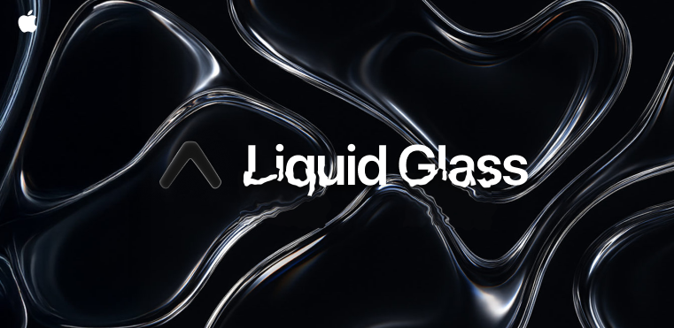

<p align="center">
  
</p>

<h1 align="center">🧊 expo-liquid-glass-view</h1>

<p align="center">
  A beautiful, SwiftUI-powered glass effect view for React Native built with Expo
</p>

---

## ✨ Features

- 🧊 Native **glassEffect** on iOS
- 🍏 Powered by **SwiftUI** for ultra-smooth performance
- 🧱 Configurable corner radius and style (continuous or circular)
- 🌈 Custom **tint overlays** and **blur strength types**
- 🧩 Supports nesting **React Native children**

---

## 🚀 Installation

### 1. Add the package

```bash
npx expo install expo-liquid-glass-view
```

### 2. Install CocoaPods

```bash
cd ios && pod install
```

### 3. Prebuild the iOS project

```bash
npx expo prebuild --platform ios
```

### 4. Run your app

```bash
npx expo run:ios
```

> ⚠️ **iOS only** — This view uses SwiftUI and does not support Android.

---

## 📦 Usage

```tsx
import { ExpoLiquidGlassView } from "expo-liquid-glass-view";

export default function App() {
  return (
    <ExpoLiquidGlassView
      type="regular"
      tint="systemMaterial"
      cornerRadius={24}
      cornerStyle="continuous"
      style={{ width: 200, height: 200, alignSelf: "center", marginTop: 100 }}
    >
      <Text style={{ color: "#fff", textAlign: "center" }}>
        Liquid Glass ✨
      </Text>
    </ExpoLiquidGlassView>
  );
}
```

---

## ⚙️ Props

| Prop           | Type                                                            | Default        | Description                                                                |
| -------------- | --------------------------------------------------------------- | -------------- | -------------------------------------------------------------------------- |
| `type`         | `"clear" \| "tint" \| "regular" \| "interactive" \| "identity"` | `"regular"`    | Defines the glass blur intensity and system effect                         |
| `tint`         | `string`                                                        | `undefined`    | Optional iOS system tint, like `"systemUltraThinMaterial"` or custom color |
| `cornerRadius` | `number`                                                        | `12`           | Border radius in points                                                    |
| `cornerStyle`  | `"continuous"` \| `"circular"`                                  | `"continuous"` | Defines the curvature style of the corners                                 |
| `style`        | `StyleProp<ViewStyle>`                                          | `undefined`    | React Native style object                                                  |
| `children`     | `React.ReactNode`                                               | `undefined`    | Optional React children to render inside the glass                         |

---

## 🧪 Types

```ts
export enum CornerStyle {
  Continuous = "continuous",
  Circular = "circular",
}

export enum LiquidGlassType {
  Clear = "clear",
  Tint = "tint",
  Regular = "regular",
  Interactive = "interactive",
  Identity = "identity",
}

export interface ExpoLiquidGlassViewProps {
  type?: LiquidGlassType;
  tint?: string;
  cornerRadius?: number;
  cornerStyle?: CornerStyle;
  style?: StyleProp<ViewStyle>;
  children?: React.ReactNode;
}
```

---

## 📱 Platform Support

- ✅ iOS _(SwiftUI)_
- ❌ Android _(not supported)_

---

## 🛠 Built With

- ⚛️ [Expo Modules](https://docs.expo.dev/modules/overview/)
- 🍎 [SwiftUI](https://developer.apple.com/documentation/swiftui/)
- 📱 [React Native](https://reactnative.dev/)

---

## 🧩 Related Ideas

If you're building glassmorphic UIs, try pairing this with:

- `expo-blur`
- `expo-symbols`
- `react-native-skia`

---

## ❤️ Contributing

PRs and issues are welcome! Let’s keep building beautiful native UIs with React Native + SwiftUI!

---

## 📄 License

MIT © [rit3zh](https://github.com/rit3zh)

---

Let me know if you'd like to add example GIFs, inline code comments, or a playground Expo Snack for demo.
